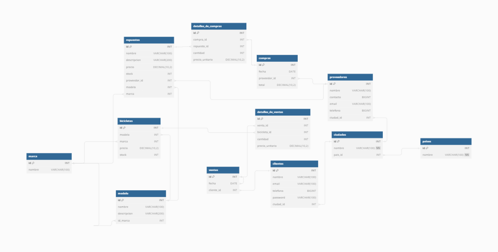

# Proyecto Base de Datos CampusBike


##### Integrantes

Johan Sebastián Duarte

Joseph Samuel Ospina




## Casos de Uso para la Base de Datos


### Caso de uso 1: Gestión de Inventario de Bicicletas


El administrador ingresa los detalles de la bicicleta (modelo, marca, precio, stock).

```sql
DELIMITER //
CREATE TRIGGER insertar_bicicletas
AFTER INSERT ON bicicletas
FOR EACH ROW
BEGIN
	INSERT INTO bicibletas (modelo, marca, precio, stock) VALUES
	(NEW.modelo, NEW.marca, NEW.precio, NEW.stock);
END //
DELIMITER ;

DELIMITER //
CREATE TRIGGER verificacion_bicicletas
BEFORE INSERT ON bicicletas
FOR EACH ROW
BEGIN
	IF NEW.modelo IS NULL 
	OR NEW.marca IS NULL 
	OR NEW.precio IS NULL 
	OR NEW.stock IS NULL
	THEN
	SIGNAL SQLSTATE '45000'
	SET MESSAGE_TEXT = 'Todos los campos deben ser ingresados';
	END IF;
END //
DELIMITER ;

DELIMITER //
CREATE TRIGGER numnegativos_bicicletas
BEFORE INSERT ON bicicletas
FOR EACH ROW
BEGIN
	IF NEW.precio < 0 THEN
		SIGNAL SQLSTATE '45000'
		SET MESSAGE_TEXT = 'El precio no puede ser un numero negativo';
	END IF;
END //
DELIMITER ;

INSERT INTO bicicletas (modelo, marca, precio, stock) VALUES
(3, 2, 6000000.50, 5);
```


El administrador actualiza la información (precio, stock).

```sql
UPDATE bicicletas 
SET precio = 8000000.00, stock = 15
WHERE id = 7;
```

El administrador selecciona una bicicleta para eliminar.

```sql
DELETE FROM bicicletas
WHERE id = 7;
```


### Caso de Uso 2: Registro de Ventas


El vendedor selecciona las bicicletas que el cliente desea comprar y especifica la cantidad.

```sql
DELIMITER //
CREATE TRIGGER agregar_ventas
BEFORE INSERT ON ventas 
FOR EACH ROW
BEGIN 
	INSERT INTO ventas (fecha, cliente_id)
	VALUES (NEW.fecha, NEW.cliente_id);
END
//
DELIMITER ;


DELIMITER //
CREATE TRIGGER verificacion_ventas
BEFORE INSERT ON ventas
FOR EACH ROW
BEGIN 
    IF NEW.fecha IS NULL 
    OR NEW.cliente_id IS NULL 
    THEN 
        SIGNAL SQLSTATE '45000' SET MESSAGE_TEXT = 'Los campos deben llenarse';
    END IF;
END //
DELIMITER ;

INSERT INTO ventas (fecha, cliente_id)values
('2005-08-31', 1);

DELIMITER //
CREATE TRIGGER agregar_detalles_de_ventas
BEFORE INSERT ON detalles_de_ventas 
FOR EACH ROW
BEGIN 
	INSERT INTO detalles_de_ventas (venta_id, bicicleta_id, cantidad, precio_unitario)
	VALUES (NEW.venta_id, NEW.bicicleta_id,NEW.cantidad,NEW.precio_unitario);
END
//
DELIMITER ;


DELIMITER //
CREATE TRIGGER verificacion_detalles_de_ventas
BEFORE INSERT ON detalles_de_ventas
FOR EACH ROW
BEGIN 
    IF NEW.venta_id IS NULL 
    OR NEW.bicicleta_id IS NULL 
    OR NEW.cantidad IS NULL 
    OR NEW.precio_unitario IS NULL 
    THEN 
        SIGNAL SQLSTATE '45000' SET MESSAGE_TEXT = 'Los campos deben llenarse';
    END IF;
END //
DELIMITER ;

INSERT INTO detalles_de_ventas (venta_id, bicicleta_id, cantidad) VALUES
(5, 5, 3, 4000000.50);
```


El sistema calcula el total de la venta.

```sql
SELECT v.id AS id_venta,
SUM(dv.cantidad * dv.precio_unitario) AS total_venta
FROM ventas v
INNER JOIN detalles_de_ventas dv ON v.id = dv.venta_id
GROUP BY v.id;
```


El sistema guarda la venta y actualiza el inventario de bicicletas.

```sql
DELIMITER //
CREATE TRIGGER actualizar_stock_bicicleta
AFTER INSERT ON detalles_de_ventas
FOR EACH ROW
BEGIN
    UPDATE bicicletas
    SET stock = stock - NEW.cantidad
    WHERE id = NEW.bicicleta_id;
END; //

DELIMITER ;
BEGIN;
INSERT INTO ventas (fecha, cliente_id)
VALUES ('2005-08-31', 1);

INSERT INTO detalles_de_ventas (venta_id, bicicleta_id, cantidad, precio_unitario)
VALUES (LAST_INSERT_ID(), 5, 3, 4000000.50);
COMMIT;
```


### Caso de Uso 3: Gestión de Proveedores y Repuestos

El administrador ingresa los detalles del proveedor (nombre, contacto, teléfono, correo
electrónico, ciudad).

  ```sql
    DELIMITER //
    CREATE TRIGGER verificacion_proveedores
    BEFORE INSERT ON proveedores
    FOR EACH ROW
    BEGIN
    	IF NEW.nombre IS NULL 
    	OR NEW.contacto IS NULL 
    	OR NEW.email IS NULL 
    	OR NEW.telefono IS NULL
    	OR NEW.ciudad_id IS NULL
    	THEN
    	SIGNAL SQLSTATE '45000'
    	SET MESSAGE_TEXT = 'Todos los campos deben ser ingresados';
    	END IF;
    END //
    DELIMITER ;
    
    DELIMITER //
    CREATE TRIGGER numero_proveedores
    BEFORE INSERT ON proveedores
    FOR EACH ROW
    BEGIN
    	IF CHAR_LENGTH(NEW.telefono) != 10
    	THEN
    	SIGNAL SQLSTATE '45000'
    	SET MESSAGE_TEXT = 'Debes ingresar un numero de telefono valido; ejemplo (3123345678)';
    	END IF;
    END //
    DELIMITER ;
    
    INSERT INTO proveedores (nombre, contacto, email, telefono, ciudad_id) 
    VALUES ('JH', 3129837777, 'quebendicion@compartan.com',7777 ,7);
  ```


El administrador ingresa los detalles del repuesto (nombre, descripción, precio, stock,
proveedor).

  ```sql
    DELIMITER //
    CREATE TRIGGER verificacion_repuestos
    BEFORE INSERT ON repuestos
    FOR EACH ROW
    BEGIN
    	IF NEW.nombre IS NULL 
    	OR NEW.descripcion IS NULL 
    	OR NEW.precio IS NULL 
    	OR NEW.stock IS NULL
    	OR NEW.modelo IS NULL
    	OR NEW.marca IS NULL
    	THEN
    	SIGNAL SQLSTATE '45000'
    	SET MESSAGE_TEXT = 'Todos los campos deben ser ingresados';
    	END IF;
    END //
    DELIMITER ;
  
    DELIMITER //
    CREATE TRIGGER numnegativos_repuestos
    BEFORE INSERT ON repuestos
    FOR EACH ROW
    BEGIN
    	IF NEW.precio < 0 THEN
    		SIGNAL SQLSTATE '45000'
    		SET MESSAGE_TEXT = 'El precio no puede ser un numero negativo';
    	END IF;
    END //
    DELIMITER ;
  
    DELIMITER //
    CREATE TRIGGER numnegativos_stock
    BEFORE INSERT ON repuestos
    FOR EACH ROW
    BEGIN
    	IF NEW.stock < 1 THEN
    		SIGNAL SQLSTATE '45000'
    		SET MESSAGE_TEXT = 'El stock no puede ser menor a uno';
    	END IF;
    END //
    DELIMITER ;
    
  INSERT INTO repuestos (nombre, descripcion, precio, stock, proveedor_id, modelo, marca)
  VALUES ('murillo', 'simplemente murrilo detonando a jh', 1000.00, 20, 6, 5, 2 );
  ```


El administrador actualiza la información del proveedor.

```sql
UPDATE proveedores 
SET nombre = 'la liendra'
WHERE id = 6;
```


El administrador selecciona un repuesto existente para actualizar.

```sql
UPDATE repuestos 
SET nombre = 'reykon', descripcion = 'pelea epica por luisa castro'
WHERE id = 6;
```


El administrador selecciona un proveedor para eliminar.

```sql
DELETE FROM proveedores 
WHERE id = 6;
```


El administrador selecciona un repuesto para eliminar.

```sql
DELETE FROM repuestos 
WHERE id = 6;
```


### Caso de Uso 4: Consulta de Historial de Ventas por Cliente

El usuario selecciona la opción para consultar el historial de ventas.

```sql
SELECT id, fecha, cliente_id 
FROM ventas;
```


El usuario selecciona el cliente del cual desea ver el historial.

```sql
SELECT id, fecha, cliente_id 
FROM ventas
WHERE id = 1;
```


El sistema muestra todas las ventas realizadas por el cliente seleccionado.

```sql
+----+------------+------------+
| id | fecha      | cliente_id |
+----+------------+------------+
|  1 | 2023-01-15 |          1 |
+----+------------+------------+
```


El usuario selecciona una venta específica para ver los detalles.

```sql
SELECT v.id AS "Id de la venta", v.fecha AS "Fecha de la compra", d.venta_id, d.cantidad, d.precio_unitario
FROM ventas AS v
JOIN detalles_de_ventas AS d ON v.id = d.venta_id
WHERE v.id = 1;
```


El sistema muestra los detalles de la venta seleccionada (bicicletas compradas, cantidad,
precio).

  ```sql
  SELECT Bicicleta_id, venta_id AS "Id de la compra", cantidad, precio_unitario
  FROM detalles_de_ventas;
  ```

  

### Caso de Uso 5: Gestión de Compras de Repuestos

El administrador selecciona la opción para registrar una nueva compra.

```sql
DELIMITER //
CREATE TRIGGER verificacion_compras
BEFORE INSERT ON compras
FOR EACH ROW
BEGIN
 IF NEW.fecha IS NULL 
 OR NEW.proveedor_id IS NULL 
 OR NEW.total IS NULL 
 THEN
 SIGNAL SQLSTATE '45000'
 SET MESSAGE_TEXT = 'Todos los campos deben ser ingresados';
 END IF;
END //
DELIMITER ;

DELIMITER //
CREATE TRIGGER numnegativos_compras
BEFORE INSERT ON compras
FOR EACH ROW
BEGIN
	IF NEW.total < 1 THEN
		SIGNAL SQLSTATE '45000'
		SET MESSAGE_TEXT = 'El total no puede ser menor a 1';
	END IF;
END //
DELIMITER ;

INSERT INTO compras (fecha, proveedor_id, total)
VALUES ('2024-07-25', 1, 10000);
```


El administrador selecciona el proveedor al que se realizó la compra.

```sql
SELECT id ,fecha, proveedor_id, total
FROM compras
WHERE id = 6;
```


El administrador ingresa los detalles de la compra (fecha, total).

```sql
DELIMITER //
CREATE TRIGGER verificacion_detallescompra
BEFORE INSERT ON detalles_de_compras
FOR EACH ROW
BEGIN
 IF NEW.compra_id IS NULL 
 OR NEW.cantidad IS NULL 
 OR NEW.precio_unitario IS NULL
 OR NEW.fecha IS NULL
 OR NEW.total IS NULL
 THEN
 SIGNAL SQLSTATE '45000'
 SET MESSAGE_TEXT = 'Todos los campos deben ser ingresados';
 END IF;
END //
DELIMITER ;

  DELIMITER //
  CREATE TRIGGER numnegativos_stock
  BEFORE INSERT ON detalles_de_compras
  FOR EACH ROW
  BEGIN
  	IF NEW.cantidad < 1 THEN
  		SIGNAL SQLSTATE '45000'
  		SET MESSAGE_TEXT = 'La cantidad no puede ser menor a uno';
  	END IF;
  END //
  DELIMITER ;
  
    DELIMITER //
  CREATE TRIGGER numnegativos_precio
  BEFORE INSERT ON detalles_de_compras
  FOR EACH ROW
  BEGIN
  	IF NEW.precio_unitario < 1 THEN
  		SIGNAL SQLSTATE '45000'
  		SET MESSAGE_TEXT = 'El precio unitario no puede ser menor a uno';
  	END IF;
  END //
  DELIMITER ;

INSERT INTO detalles_de_compras (compra_id, cantidad, precio_unitario, fecha, total)
VALUES (1, 10, 210000.75, 2023-10-26, 100000)
```


El administrador selecciona los repuestos comprados y especifica la cantidad y el precio
unitario.

```sql
DELIMITER //
CREATE TRIGGER verificacion_repuestos
BEFORE INSERT ON repuestos
FOR EACH ROW
BEGIN
 IF NEW.nombre IS NULL 
 OR NEW.descripcion IS NULL 
 OR NEW.precio IS NULL
 OR NEW.stock IS NULL
 OR NEW.proveedor_id IS NULL
 OR NEW.modelo IS NULL
 OR NEW.marca IS NULL
 THEN
 SIGNAL SQLSTATE '45000'
 SET MESSAGE_TEXT = 'Todos los campos deben ser ingresados';
 END IF;
END //
DELIMITER ;

  DELIMITER //
  CREATE TRIGGER numnegativos_repuestos
  BEFORE INSERT ON repuestos
  FOR EACH ROW
  BEGIN
  	IF NEW.stock < 0 
  	OR NEW.Precio < 1
  	THEN
  		SIGNAL SQLSTATE '45000'
  		SET MESSAGE_TEXT = 'un valor ingresado no es valido';
  	END IF;
  END //
  DELIMITER ;


INSERT INTO repuestos (nombre, descripcion, precio, stock, proveedor_id, modelo, marca)
VALUES ('Cadena', 'Cadena para bicicleta de montaña', 210000.75, 20, 1, 1, 1)
```


## Casos de Uso con Subconsultas


### Caso de Uso 6: Consulta de Bicicletas Más Vendidas por Marca

El usuario selecciona la opción para consultar las bicicletas más vendidas por marca.

```sql

```


El sistema muestra una lista de marcas y el modelo de bicicleta más vendido para cada marca.

```sql

```


### Caso de Uso 7: Clientes con Mayor Gasto en un Año Específico

El administrador selecciona la opción para consultar los clientes con mayor gasto en un año
específico.

  ```sql
  
  ```

  

El administrador ingresa el año deseado.

```sql

```


El sistema muestra una lista de los clientes que han gastado más en ese año, ordenados por
total gastado.

```sql

```


### Caso de Uso 8: Proveedores con Más Compras en el Último Mes

El administrador selecciona la opción para consultar los proveedores con más compras en el
último mes.

  ```sql
  
  ```

  

El sistema muestra una lista de proveedores ordenados por el número de compras recibidas
en el último mes.

  ```sql
  
  ```

  

### Caso de Uso 9: Repuestos con Menor Rotación en el Inventario

El administrador selecciona la opción para consultar los repuestos con menor rotación.

```sql

```


El sistema muestra una lista de repuestos ordenados por la cantidad vendida, de menor a
mayor.

  ```sql
  
  ```

  

### Caso de Uso 10: Ciudades con Más Ventas Realizadas

El administrador selecciona la opción para consultar las ciudades con más ventas realizadas.

```sql

```


El sistema muestra una lista de ciudades ordenadas por la cantidad de ventas realizadas.

```sql

```


## Casos de Uso con Joins


### Caso de Uso 11: Consulta de Ventas por Ciudad

El administrador selecciona la opción para consultar las ventas por ciudad.

```sql
SELECT v.fecha, c.nombre AS 'nombre del cliente', c.email, c.telefono, c.password, ci.nombre AS 'nombre de la ciudad'
FROM ventas AS v
JOIN clientes AS c ON v.cliente_id = c.id
JOIN ciudades AS ci ON c.ciudad_id = ci.id;
```


El sistema muestra una lista de ciudades con el total de ventas realizadas en cada una.

```sql
SELECT ci.nombre, de.cantidad
FROM ciudades AS ci
JOIN clientes AS c ON ci.id = c.ciudad_id
JOIN ventas AS v ON c.id = v.cliente_id
JOIN detalles_de_ventas AS de ON v.id = de.venta_id;
```

```sql
+--------------+----------+
| nombre       | cantidad |
+--------------+----------+
| Bogotá       |        1 |
| Medellín     |        2 |
| Cali         |        3 |
| Barranquilla |        1 |
| Cartagena    |        2 |
+--------------+----------+
```


### Caso de Uso 12: Consulta de Proveedores por País

El administrador selecciona la opción para consultar los proveedores por país.

```sql
SELECT p.nombre AS 'nombre de los paises', pr.nombre AS 'nombre proveedor'
FROM proveedores AS pr
JOIN ciudades AS c ON pr.ciudad_id = c.id
JOIN paises AS p ON c.pais_id = p.id;
```


El sistema muestra una lista de países con los proveedores en cada país.

```sql
+----------------------+------------------+
| nombre de los paises | nombre proveedor |
+----------------------+------------------+
| Estados Unidos       | Giant            |
| México               | Scott            |
| Canadá               | Specialized      |
| España               | Trek             |
| Colombia             | Mongoose         |
+----------------------+------------------+
```


### Caso de Uso 13: Compras de Repuestos por Proveedor

El administrador selecciona la opción para consultar las compras de repuestos por
proveedor.

  ```sql
  SELECT p.nombre AS "nombre del proveedor", d.cantidad AS "cantidad de compras al proveedor"
  FROM proveedores AS p
  JOIN compras AS c ON p.id = c.proveedor_id
  JOIN detalles_de_compras AS d ON c.id = d.compra_id;
  ```

  

El sistema muestra una lista de proveedores con el total de repuestos comprados a cada
uno.

  ```sql
  +----------------------+----------------------------------+
  | nombre del proveedor | cantidad de compras al proveedor |
  +----------------------+----------------------------------+
  | Giant                |                               10 |
  | Scott                |                               10 |
  | Specialized          |                               20 |
  | Trek                 |                               20 |
  | Mongoose             |                               25 |
  +----------------------+----------------------------------+
  ```

  

### Caso de Uso 14: Clientes con Ventas en un Rango de Fechas

El usuario selecciona la opción para consultar los clientes con ventas en un rango de fechas.

```sql
SELECT id, fecha 
FROM ventas 
WHERE fecha BETWEEN 'fecha inicial' AND 'fecha final';
```


El usuario ingresa las fechas de inicio y fin del rango.

```sql
SELECT id, fecha 
FROM ventas 
WHERE fecha BETWEEN '2023-03-05' AND '2023-05-25';
```


El sistema muestra una lista de clientes que han realizado compras dentro del rango de
fechas especificado.

  ```sql
  +----+------------+
  | id | fecha      |
  +----+------------+
  |  3 | 2023-03-05 |
  |  4 | 2023-04-10 |
  |  5 | 2023-05-25 |
  +----+------------+
  ```


## Casos de Uso para Implementar Procedimientos Almacenados


### Caso de Uso 1: Actualización de Inventario de Bicicletas


El sistema llama a un procedimiento almacenado para actualizar el inventario de las
bicicletas vendidas.

  ```sql
  
  ```

  

El procedimiento almacenado actualiza el stock de cada bicicleta.

```sql

```


### Caso de Uso 2: Registro de Nueva Venta

El vendedor registra una nueva venta.

```sql
DELIMITER //
CREATE TRIGGER agregar_ventas
BEFORE INSERT ON ventas 
FOR EACH ROW
BEGIN 
	INSERT INTO ventas (fecha, cliente_id)
	VALUES (NEW.fecha, NEW.cliente_id);
END
//
DELIMITER ;


DELIMITER //
CREATE TRIGGER verificacion_ventas
BEFORE INSERT ON ventas
FOR EACH ROW
BEGIN 
    IF NEW.fecha IS NULL 
    OR NEW.cliente_id IS NULL 
    THEN 
        SIGNAL SQLSTATE '45000' SET MESSAGE_TEXT = 'Los campos deben llenarse';
    END IF;
END //
DELIMITER ;

INSERT INTO ventas (fecha, cliente_id)
VALUES ('2024-07-26', 1); 
```


El sistema llama a un procedimiento almacenado para registrar la venta y sus detalles.

```sql
INSERT INTO detalles_de_ventas (venta_id, bicicleta_id, cantidad) VALUES
(5, 5, 3, 4000000.50);

INSERT INTO ventas (fecha, cliente_id)values
('2005-08-31', 1);

//--------- TRIGGER YA EXISTENTES ---------------

DELIMITER //
CREATE TRIGGER agregar_ventas
BEFORE INSERT ON ventas 
FOR EACH ROW
BEGIN 
	INSERT INTO ventas (fecha, cliente_id)
	VALUES (NEW.fecha, NEW.cliente_id);
END
//
DELIMITER ;


DELIMITER //
CREATE TRIGGER verificacion_ventas
BEFORE INSERT ON ventas
FOR EACH ROW
BEGIN 
    IF NEW.fecha IS NULL 
    OR NEW.cliente_id IS NULL 
    THEN 
        SIGNAL SQLSTATE '45000' SET MESSAGE_TEXT = 'Los campos deben llenarse';
    END IF;
END //
DELIMITER ;

DELIMITER //
CREATE TRIGGER agregar_detalles_de_ventas
BEFORE INSERT ON detalles_de_ventas 
FOR EACH ROW
BEGIN 
	INSERT INTO detalles_de_ventas (venta_id, bicicleta_id, cantidad, precio_unitario)
	VALUES (NEW.venta_id, NEW.bicicleta_id,NEW.cantidad,NEW.precio_unitario);
END
//
DELIMITER ;


DELIMITER //
CREATE TRIGGER verificacion_detalles_de_ventas
BEFORE INSERT ON detalles_de_ventas
FOR EACH ROW
BEGIN 
    IF NEW.venta_id IS NULL 
    OR NEW.bicicleta_id IS NULL 
    OR NEW.cantidad IS NULL 
    OR NEW.precio_unitario IS NULL 
    THEN 
        SIGNAL SQLSTATE '45000' SET MESSAGE_TEXT = 'Los campos deben llenarse';
    END IF;
END //
DELIMITER ;
```


### Caso de Uso 3: Generación de Reporte de Ventas por Cliente

El administrador selecciona un cliente para generar un reporte de ventas.

```sql
SELECT id, fecha, cliente_id
FROM ventas
WHERE cliente_id = 1;
```


El sistema llama a un procedimiento almacenado para generar el reporte.

```sql
+----+------------+------------+
| id | fecha      | cliente_id |
+----+------------+------------+
|  1 | 2023-01-15 |          1 |
+----+------------+------------+
```


El procedimiento almacenado obtiene las ventas y los detalles de las ventas realizadas por el
cliente.

  ```sql
  
  ```

  

### Caso de Uso 4: Registro de Compra de Repuestos

El administrador registra una nueva compra.

```sql
INSERT INTO compras (fecha, proveedor_id, total)
VALUES ('2024-07-26', 1, 20000.00);
```


El sistema llama a un procedimiento almacenado para registrar la compra y sus detalles.

```sql
INSERT INTO compras (fecha, proveedor_id, total)
VALUES ('2024-07-26', 1, 20000.00);
INSERT INTO detalles_de_compras (compra_id, repuesto_id, cantidad, precio_unitario)
VALUES (6, 1,4, 5000.00);
```


El procedimiento almacenado inserta la compra y sus detalles en las tablas correspondientes
y actualiza el stock de repuestos.

  ```sql
  
  ```

  

### Caso de Uso 5: Generación de Reporte de Inventario

El administrador solicita un reporte de inventario.

```sql

```


El sistema llama a un procedimiento almacenado para generar el reporte.

```sql

```


El procedimiento almacenado obtiene la información del inventario de bicicletas y repuestos.

```sql

```


### Caso de Uso 6: Actualización Masiva de Precios

El administrador selecciona la opción para actualizar los precios de una marca específica.

```sql

```


El administrador ingresa la marca y el porcentaje de incremento.

```sql

```


El sistema llama a un procedimiento almacenado para actualizar los precios.

```sql

```


El procedimiento almacenado actualiza los precios de todas las bicicletas de la marca
especificada.

  ```sql
  
  ```

  

### Caso de Uso 7: Generación de Reporte de Clientes por Ciudad

El administrador selecciona la opción para generar un reporte de clientes por ciudad.

```sql

```


El sistema llama a un procedimiento almacenado para generar el reporte.

```sql

```


El procedimiento almacenado obtiene la información de los clientes agrupados por ciudad.

```sql

```


### Caso de Uso 8: Verificación de Stock antes de Venta

El vendedor selecciona una bicicleta para vender.

```sql

```


El sistema llama a un procedimiento almacenado para verificar el stock.

```sql

```


El procedimiento almacenado devuelve un mensaje indicando si hay suficiente stock para
realizar la venta.

  ```sql
  
  ```

  

### Caso de Uso 9: Registro de Devoluciones

El vendedor registra una devolución de bicicleta.

```sql

```


El sistema llama a un procedimiento almacenado para registrar la devolución.

```sql

```


El procedimiento almacenado inserta la devolución y actualiza el stock de la bicicleta.

```sql

```


### Caso de Uso 10: Generación de Reporte de Compras por Proveedor

El administrador selecciona un proveedor para generar un reporte de compras.

```sql

```


El sistema llama a un procedimiento almacenado para generar el reporte.

```sql

```


El procedimiento almacenado obtiene las compras y los detalles de las compras realizadas al
proveedor.

  ```sql
  
  ```

  

### Caso de Uso 11: Calculadora de Descuentos en Ventas

El vendedor aplica un descuento a una venta.

```sql

```


El sistema llama a un procedimiento almacenado para calcular el total con descuento.

```sql

```


El procedimiento almacenado calcula el total con el descuento aplicado y registra la venta.

```sql

```


## Casos de Uso para Funciones de Resumen


### Caso de Uso 1: Calcular el Total de Ventas Mensuales

El administrador selecciona la opción para calcular el total de ventas mensuales.

```sql

```


El administrador ingresa el mes y el año.

```sql

```


El sistema llama a un procedimiento almacenado para calcular el total de ventas.

```sql

```


El procedimiento almacenado devuelve el total de ventas del mes especificado.

```sql

```


### Caso de Uso 2: Calcular el Promedio de Ventas por Cliente

El administrador ingresa el ID del cliente.

```sql

```


El sistema llama a un procedimiento almacenado para calcular el promedio de ventas.

```sql

```


El procedimiento almacenado devuelve el promedio de ventas del cliente especificado.

```sql

```


### Caso de Uso 3: Contar el Número de Ventas Realizadas en un Rango de Fechas

El administrador selecciona la opción para contar el número de ventas en un rango de
fechas.

  ```sql
  
  ```

  

El administrador ingresa las fechas de inicio y fin.

```sql

```


El sistema llama a un procedimiento almacenado para contar las ventas.

```sql

```


El procedimiento almacenado devuelve el número de ventas en el rango de fechas
especificado.

  ```sql
  
  ```

  

### Caso de Uso 4: Calcular el Total de Repuestos Comprados por Proveedor

El administrador selecciona la opción para calcular el total de repuestos comprados por
proveedor.

  ```sql
  
  ```

  

El administrador ingresa el ID del proveedor.

```sql

```


El sistema llama a un procedimiento almacenado para calcular el total de repuestos.

```sql

```


El procedimiento almacenado devuelve el total de repuestos comprados al proveedor
especificado.

  ```sql
  
  ```

  

### Caso de Uso 5: Calcular el Ingreso Total por Año

El administrador selecciona la opción para calcular el ingreso total por año.

```sql

```


El administrador ingresa el año.

```sql

```


El sistema llama a un procedimiento almacenado para calcular el ingreso total.

```sql

```


El procedimiento almacenado devuelve el ingreso total del año especificado.

```sql

```


### Caso de Uso 6: Calcular el Número de Clientes Activos en un Mes

El administrador selecciona la opción para contar el número de clientes activos en un mes.

```sql

```


El administrador ingresa el mes y el año.

```sql

```


El sistema llama a un procedimiento almacenado para contar los clientes activos.

```sql

```


El procedimiento almacenado devuelve el número de clientes que han realizado compras en
el mes especificado.

  ```sql
  
  ```

  

### Caso de Uso 7: Calcular el Promedio de Compras por Proveedor

El administrador selecciona la opción para calcular el promedio de compras por proveedor.

```sql

```


El administrador ingresa el ID del proveedor.

```sql

```


El sistema llama a un procedimiento almacenado para calcular el promedio de compras.

```sql

```


El procedimiento almacenado devuelve el promedio de compras del proveedor especificado.

```sql

```


### Caso de Uso 8: Calcular el Total de Ventas por Marca

El administrador selecciona la opción para calcular el total de ventas por marca.

```sql

```


El sistema llama a un procedimiento almacenado para calcular el total de ventas por marca.

```sql

```


El procedimiento almacenado devuelve el total de ventas agrupadas por marca.

```sql

```


### Caso de Uso 9: Calcular el Promedio de Precios de Bicicletas por Marca

El administrador selecciona la opción para calcular el promedio de precios por marca.

```sql

```


El sistema llama a un procedimiento almacenado para calcular el promedio de precios.

```sql

```


El procedimiento almacenado devuelve el promedio de precios agrupadas por marca.

```sql

```


### Caso de Uso 10: Contar el Número de Repuestos por Proveedor

El administrador selecciona la opción para contar el número de repuestos por proveedor.

```sql

```


El sistema llama a un procedimiento almacenado para contar los repuestos.

```sql

```


El procedimiento almacenado devuelve el número de repuestos suministrados por cada
proveedor.

  ```sql
  
  ```

  

### Caso de Uso 11: Calcular el Total de Ingresos por Cliente

El administrador selecciona la opción para calcular el total de ingresos por cliente.

```sql

```


El sistema llama a un procedimiento almacenado para calcular el total de ingresos.

```sql

```


El procedimiento almacenado devuelve el total de ingresos generados por cada cliente.

```sql

```


### Caso de Uso 12: Calcular el Promedio de Compras Mensuales

El administrador selecciona la opción para calcular el promedio de compras mensuales.

```sql

```


El sistema llama a un procedimiento almacenado para calcular el promedio de compras
mensuales.

  ```sql
  
  ```

  

El procedimiento almacenado devuelve el promedio de compras realizadas mensualmente.

```sql

```


### Caso de Uso 13: Calcular el Total de Ventas por Día de la Semana

El administrador selecciona la opción para calcular el total de ventas por día de la semana.

```sql

```


El sistema llama a un procedimiento almacenado para calcular el total de ventas.

```sql

```


El procedimiento almacenado devuelve el total de ventas agrupadas por día de la semana.

```sql

```


### Caso de Uso 14: Contar el Número de Ventas por Categoría de Bicicleta

El administrador selecciona la opción para contar el número de ventas por categoría de
bicicleta.

  ```sql
  
  ```

  

El sistema llama a un procedimiento almacenado para contar las ventas.

```sql

```


El procedimiento almacenado devuelve el número de ventas por categoría de bicicleta.

```sql

```


### Caso de Uso 15: Calcular el Total de Ventas por Año y Mes

El administrador selecciona la opción para calcular el total de ventas por año y mes.

```sql

```


El sistema llama a un procedimiento almacenado para calcular el total de ventas.

```sql

```


El procedimiento almacenado devuelve el total de ventas agrupadas por año y mes.

```sql
ASSS
```

